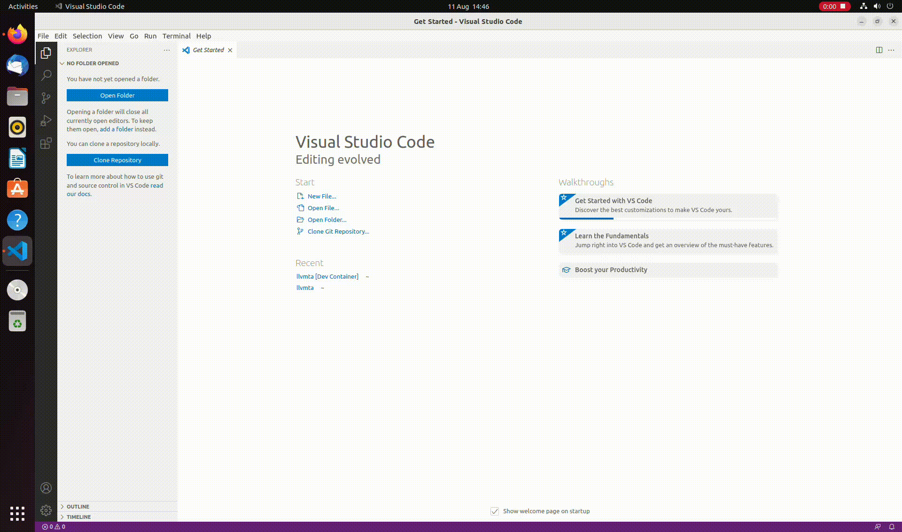
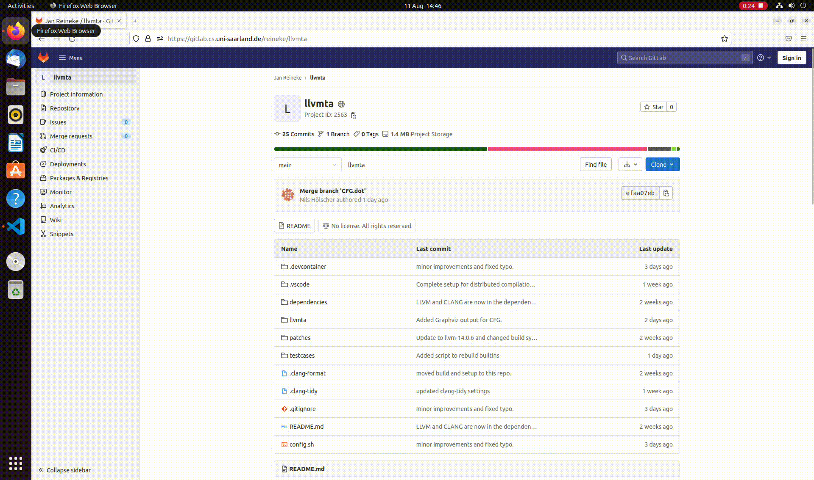

# Bit-Flip-Simulation
This Repository should enable the user to use our Gem5+NVMain setup, Unikraft and Benchmark apps to measure/evaluate NVM memory on single bit flip granularity.
## Setup with VS Code and Docker development container

1.) Get [VS CODE](https://code.visualstudio.com/) and necessary [extensions](https://code.visualstudio.com/docs/remote/remote-overview) for remote container development.



2.) This repository supports VS code development containers. Just press F1 inside VS code and execute "Remote-Containers: Open Worksapce in Container.." or click the "Open in Container" btutton on the pop up Window. After that, continue with [initializing](#using-the-benchmarks) the Project.



## Using the Benchmarks

The NVMBench.sh script provides you with everything needed tools to setup the simulator and unikraft. A help screen is available by simply running the script without any arguments.

At first initialise all submodules ind build the Gem5 + NVMain simulator with:
```
./NVMBench init
```

All apps in the unikraft_setup folder should be configured already, however they can be configured again by using:
```
./NVMBench c APPNAME
```
For more information see the Unikraft documentation.


The apps can be build with:
```
./NVMBench b APPNAME
```

Start a Simulation with:
```
./NVMBench s APPNAME
```
Simulation results will be dumped in the results/APPNAME.d folder.
The simulation starts detached from the terminal. The gem5 output is located in results/APPNAME.d/gem5.terminal. The unikraft terminal output is located at results/APPNAME.d/m5out/system.terminal

After The simulation finished executing a trace file is generated and the analysis can be executed. The results will be displayed in the terminal and a plot is generated in the results folder.
```
./NVMBench a APPNAME
```
